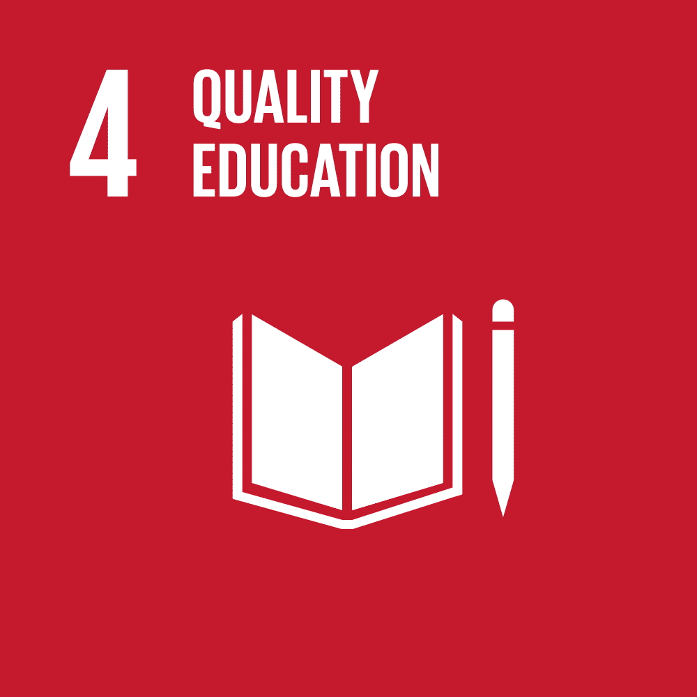
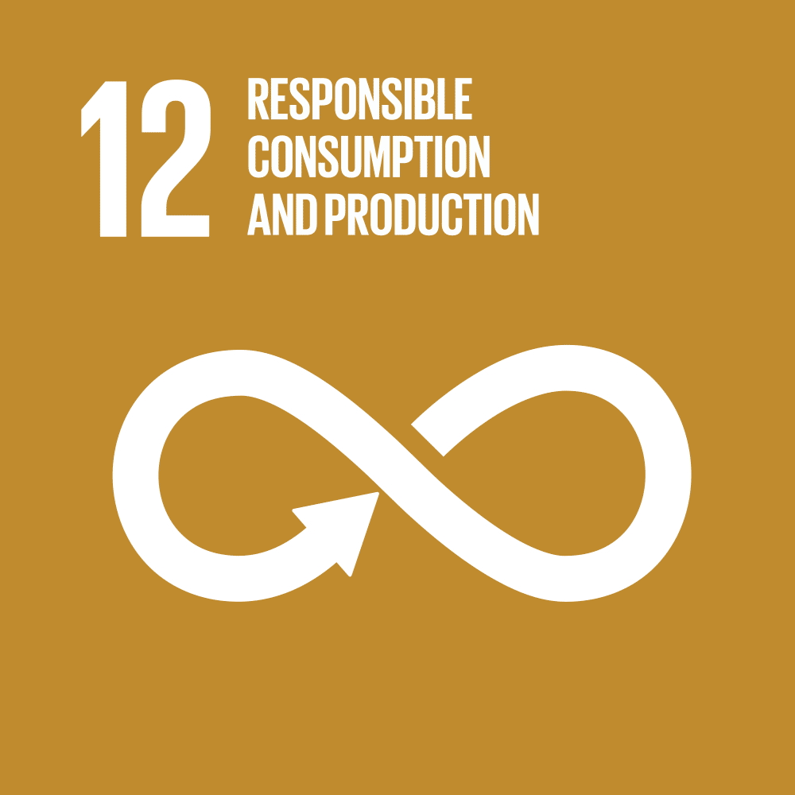

<h1 align = "center"></img></h1>

<!--insira a logo aqui-->

<h4 align = "center">Crie pratos incríveis com os ingredientes que você já tem em casa.</h4>

<h2>Funcionalidades</h2>

<ul>
  <li> Ache receitas que usam ingredientes  e utensílios que você já tem e que podem ser feitas no tempo que você tem disponível</li>
  <li> Escolha entre pesquisar com apenas ingredientes selecionados ou permita receitas com outros ingredientes também</li>
  <li> Pesquise receitas pelo nome</li>
  <li> Favorite receitas para acessa-las depois</li>
  
</img>

  <li> Exporte a receita como PDF</li>
  <li> Visualize os nutirentes de cada receita</li>
</ul>

<h2>Como usar</h2>

Por enquanto, você pode acessar o nosso <a href="https://www.figma.com/design/iFTLAaMosDRRr7w8U86GS6/remi?m=auto&t=3E2VNKbCzpQkGDym-6">protótipo</a>.

<h2>Impacto</h2>

Esse projeto visa contribuir para os seguintes Objetivos de Desenvolvimento Sustetável (ODS):

  </img>
  </img>
  </img>

<ul>
  <li><b>Meta 3.4</b> - Até 2030, reduzir em um terço a mortalidade prematura por doenças não transmissíveis via prevenção e tratamento, e promover a saúde mental e o bem-estar.</li>
  <li><b>Meta 4.7</b> - Até 2030, garantir que todos os alunos adquiram conhecimentos e habilidades necessárias para promover o desenvolvimento sustentável, inclusive, entre outros, por meio da educação para o desenvolvimento sustentável e estilos de vida sustentáveis, direitos humanos, igualdade de gênero, promoção de uma cultura de paz e não violência, cidadania global e valorização da diversidade cultural e da contribuição da cultura para o desenvolvimento sustentável.</li>
  <li><b>Meta 12.3</b> - Até 2030, reduzir pela metade o desperdício de alimentos per capita mundial, nos níveis de varejo e do consumidor, e reduzir as perdas de alimentos ao longo das cadeias de produção e abastecimento, incluindo as perdas pós-colheita.</li>
</ul>

<h2>Créditos</h2>

<h3>Contribuidores</h3>

<table>
  <tbody>
    <tr>
      <td>Gabriel Martins</td>
      <td align="center"><a href="https://github.com/GabrielaRBLemos"> Gabriela R. B. Lemos</a></td>
      <td align="center"><a href="https://github.com/mlrlima/"> Maria Luiza</a></td>
      <td align="center"><a href="https://github.com/nodemi-alt"> Matheus Veríssimo</td>
      <td>Miguel Reis</td>
    </tr>
    <tr>
      <td align="center"><a href="https://github.com/rafaelsampa"> Rafael Sampaio</a></td>
      <td align="center"><a href="https://github.com/Roberto20deluxe/"> Roberto Regis</a></td>
      <td>Salomão Pernambucano</td>
      <td align="center"><a href="https://github.com/VictorHugoJSS"> Victor Hugo José Sales da Silva</a></td>
      <td align="center"><a href="https://github.com/vini-mgan"> Vinícius Martins</a></td>
    </tr>
  </tbody>
</table>

<h3>Imagens e Ícones</h3>

Este projeto inclui recursos gráficos das seguintes fontes:

<ul>
  <li><b>Foto</b> de uma sopa de tomate por <a href="https://www.pexels.com/photo/photo-of-tomato-soup-in-a-bowl-15529479/" target="_blank" rel="noopener noreferrer">Alina Matveycheva</a></li>
  <li><b>Foto</b> de tomate por <a href="https://www.pexels.com/photo/tomato-400958/" target="_blank" rel="noopener noreferrer">Monicore</a></li>
  <li><b>Foto</b> de faca de cozinha por <a href="https://www.pexels.com/photo/kitchen-knife-on-white-surface-4226864/" target="_blank" rel="noopener noreferrer">Karolina Kaboompics</a></li>
  <li><b>Ícone</b> de livro de receita por <a href="https://icons8.com/icon/jfWkE5iEM4Jq/cooking-book" target="_blank" rel="noopener noreferrer">Icons8</a></li>
  <li><b>Ícone</b> de talheres por <a href="https://icons8.com/icon/102892/tableware" target="_blank" rel="noopener noreferrer">Icons8</a></li>
</ul>

<h2>Insenção de Responsabilidade</h2>

O conteúdo desta publicação não foi aprovado pelas Nações Unidas e não reflete as opiniões das Nações Unidas, de seus funcionários ou dos Estados-Membros.

