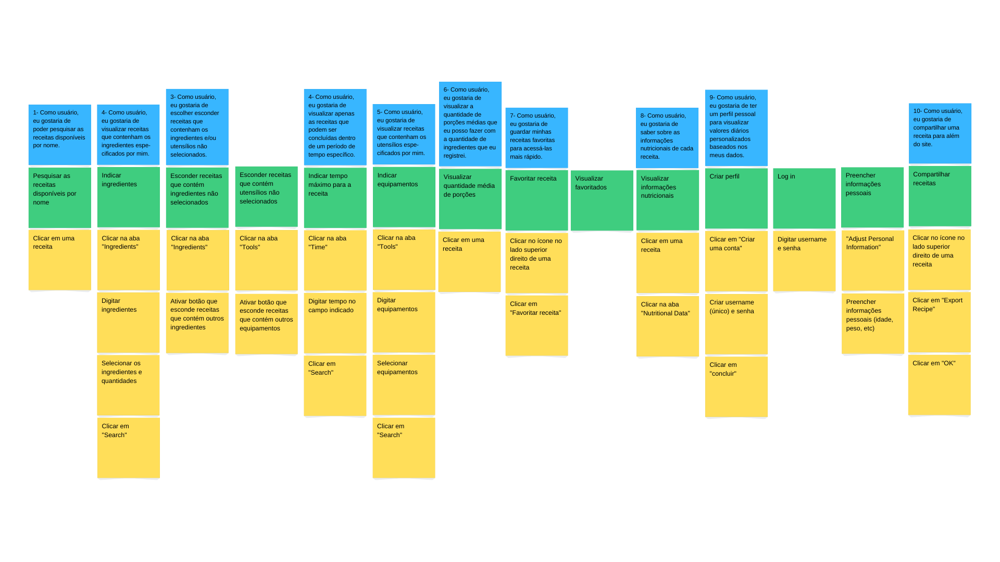
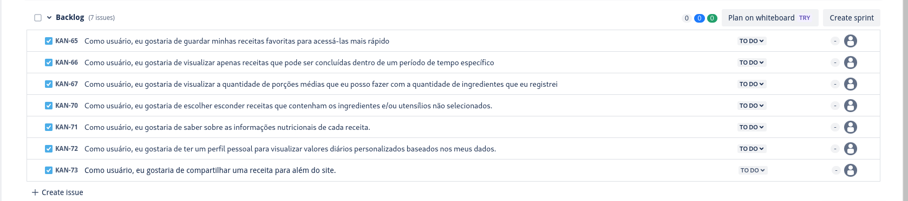
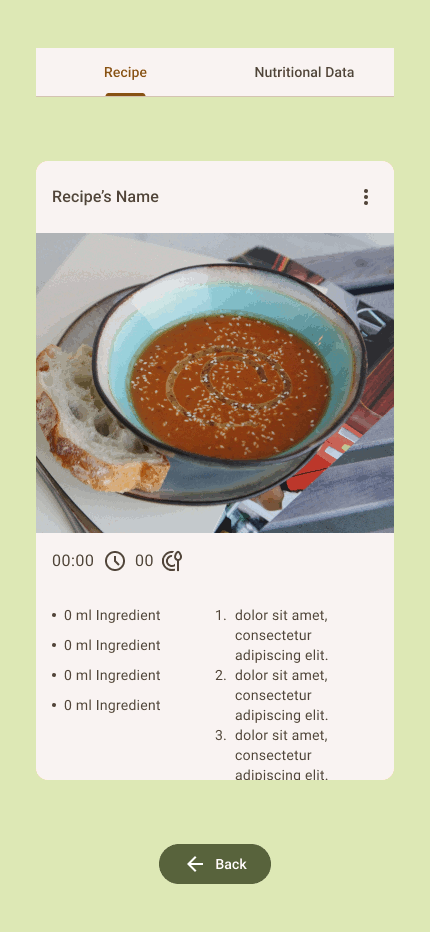
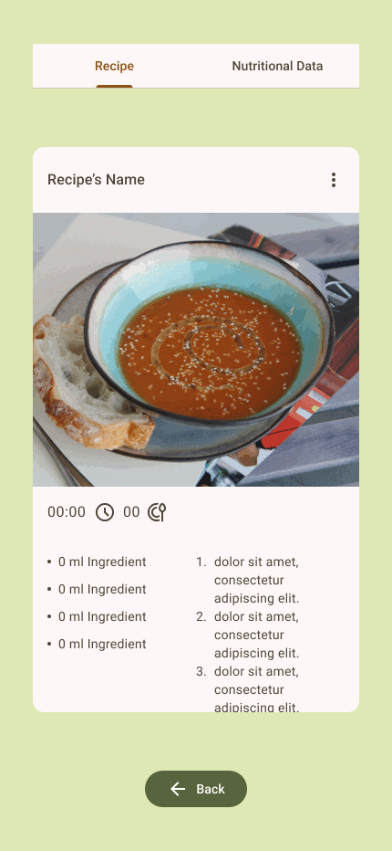
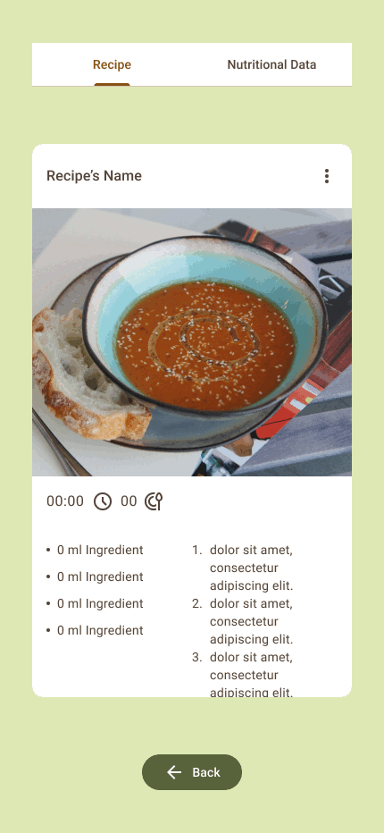
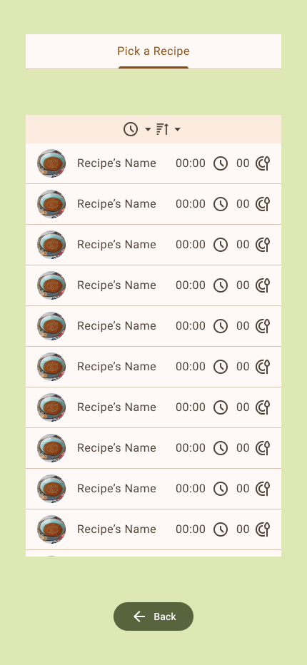
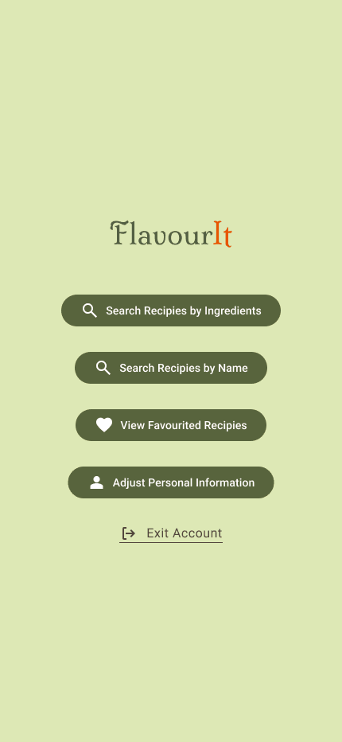
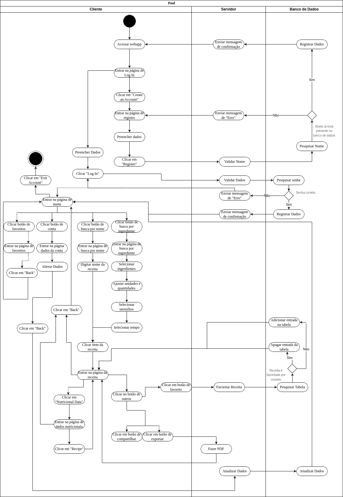
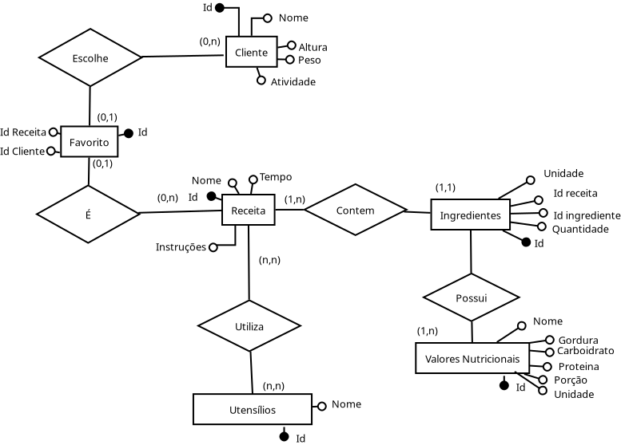
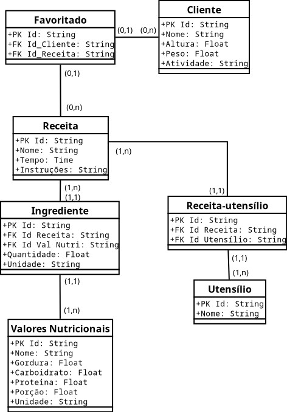

<h1 align = "center"></img><br></img></h1>

<p align="center"></p>

<h4 align = "center">Crie pratos incríveis com os ingredientes que você já tem em casa.</h4>

<h2>Funcionalidades</h2>

<ul>
  <li> Ache receitas que usam ingredientes e utensílios que você já tem e que podem ser feitas no tempo que você tem disponível</li>
  <li> Escolha entre pesquisar com apenas ingredientes e utensílios selecionados ou permita receitas com outros ingredientes e utensílios também</li>
  <li> Pesquise receitas pelo nome</li>
  <li> Favorite receitas para acessá-las depois</li>
  <li> Visualize os nutirentes de cada receita</li>
  <li> Exporte a receita como PDF</li>
</ul>

<h2>Como usar</h2>
<p>Por enquanto, você pode acessar o nosso <a href="https://www.figma.com/proto/iFTLAaMosDRRr7w8U86GS6/remi?scaling=scale-down&content-scaling=fixed&page-id=0%3A1&node-id=133-458&starting-point-node-id=133%3A458">protótipo</a>.</p>
  
<h2>Impacto</h2>

<p>Esse projeto visa contribuir para os seguintes Objetivos de Desenvolvimento Sustetável (ODS):</p>

<p align = "center">
  </img>
  </img>
  </img>
</p>

<ul>
  <li><b>Meta 3.4</b> - Até 2030, reduzir em um terço a mortalidade prematura por doenças não transmissíveis via prevenção e tratamento, e promover a saúde mental e o bem-estar.</li>
  <li><b>Meta 4.7</b> - Até 2030, garantir que todos os alunos adquiram conhecimentos e habilidades necessárias para promover o desenvolvimento sustentável, inclusive, entre outros, por meio da educação para o desenvolvimento sustentável e estilos de vida sustentáveis, direitos humanos, igualdade de gênero, promoção de uma cultura de paz e não violência, cidadania global e valorização da diversidade cultural e da contribuição da cultura para o desenvolvimento sustentável.</li>
  <li><b>Meta 12.3</b> - Até 2030, reduzir pela metade o desperdício de alimentos per capita mundial, nos níveis de varejo e do consumidor, e reduzir as perdas de alimentos ao longo das cadeias de produção e abastecimento, incluindo as perdas pós-colheita.</li>
</ul>

<h2>Entrega 1</h2>

  <details>
    <summary>Imagem do <a href="https://www.canva.com/design/DAGOfxs_Dc8/nC_RbrV_sZUsEBCPSfeCKA/edit?utm_content=DAGOfxs_Dc8&utm_campaign=designshare&utm_medium=link2&utm_source=sharebutton">Storyboard</a> </summary>
    
  </details>
    
  <details>
    <summary>Imagens do Sprint 1 e do <a href="https://unicap-team-flavour.atlassian.net/jira/software/projects/KAN/boards/1/backlog">Backlog</a> do <a href="https://unicap-team-flavour.atlassian.net/">Jira</a>, na data de 04/09/2024 </summary>
    
    
  </details>
  
  <details>
  <summary> Sketch do produto </summary>
   </img> </br>
   </img> </br>
   </img> </br>
   </img> </br>
   </img> </br>
   </img> </br>
   </img> </br>
   </img> </br>
  </details>

<details>
    <summary>Histórias de usuário </summary>
    <h4>1# Busca por nome​</h4>
    <h5>Descrição:</h5>
    <p>Como usuário, eu gostaria de poder pesquisar as receitas disponíveis por nome para acessar intruções de uma receita que já sei que quero usar mas não lembro como fazer.​</p>
    <h5>Critérios de Aceitação:​</h5>
    <ul>
      <li>Apenas receitas que contêm o termo pesquisado em seu título aparecem na lista de resultados.​</li>
      <li>A pesquisa deve ser case-insensitive.​</li>
      <li>Se não houver receitas compatíveis, aparece um aviso em vez de receitas.​</li>
    </ul>
    <h4>2# Busca por ingredientes​​</h4>
    <h5>Descrição:</h5>
    <p>Como usuário, eu gostaria de visualizar receitas que contenham os ingredientes especificados por mim para utilizar ingredientes que eu já tenho em casa.​</p>
    <h5>Critérios de Aceitação:​</h5>
    <ul>
      <li>Apenas receitas que contêm ingredientes selecionados  aparecem na lista de resultados.​</li>
      <li>O usuário pode selecionar quantos ingredientes quiser, sem restrição de quantidade.​​</li>
      <li>Caso nenhum ingrediente seja selecionado, a filtragem por ingredientes não será considerada ao mostrar os resultados da pesquisa.​</li>
    </ul>
    <h4>3# Filtragem por Utensílios​​</h4>
    <h5>Descrição:</h5>
    <p>Como usuário, eu gostaria de visualizar receitas que contenham os utensílios especificados por mim para que eu possa encontrar receitas que se adaptem ao que tenho disponível.​</p>
    <h5>Critérios de Aceitação:​</h5>
    <ul>
      <li>Receitas que utilizam utensílios selecionados  aparecem na lista de resultados.</li>
      <li>Receitas contendo outros utensílios aparecem após as receitas acima.​</li>
      <li>O usuário pode selecionar quantos utensílios quiser, sem restrição de quantidade.​</li>
      <li>Caso nenhum utensílio seja selecionado, a filtragem por utensílios não será considerada ao mostrar os resultados da pesquisa.​​</li>
    </ul>
    <h4>4# Filtragem por Tempo​</h4>
    <h5>Descrição:</h5>
    <p>Como usuário, eu gostaria de visualizar apenas as receitas que podem ser concluídas dentro de um período de tempo específico para evitar escolher uma receita que demore mais tempo do que eu tenho.​</p>
    <h5>Critérios de Aceitação:​</h5>
    <ul>
      <li>Apenas receitas com tempo de preparo igual ou menor ao tempo inserido aparecem na lista de resultados.​</li>
      <li>A opção de ordenação por tempo deve estar disponível e funcionar corretamente tanto na ordem crescente como decrescente.​</li>
      <li>Caso um período de tempo não seja especificado, a filtragem por tempo de preparo não será considerada ao mostrar os resultados da pesquisa.​​</li>
    </ul>
    <h4>5# Busca Exclusiva​​</h4>
    <h5>Descrição:</h5>
    <p>Como usuário, eu gostaria de escolher esconder receitas que contenham os ingredientes e/ou utensílios não selecionados para ver apenas recitas que eu posso fazer sem precisar ir ao mercado ou pedir algo emprestado.​</p>
    <h5>Critérios de Aceitação:​</h5>
    <ul>
      <li>Nenhuma receita que contém ingredientes e/ou utensílios não selecionados aparece na lista de resultados quando as respectivas opções estão ativadas.​</li>
      <li>Se não houver receitas compatíveis, aparece um aviso em vez de receitas.​</li>
    </ul>
    <h4>6# Porções​​</h4>
    <h5>Descrição:</h5>
    <p>Como usuário, eu gostaria de visualizar a quantidade de porções médias que eu posso fazer com a quantidade de ingredientes que eu registrei para que eu possa planejar melhor a quantidade de comida que vou preparar.​</p>
    <h5>Critérios de Aceitação:​</h5>
    <ul>
      <li>A quantidade de porções possíveis baseado na quantidade de ingredientes visível na lista de resultados e no card da receita selecionada.​​</li>
      <li>O próprio algoritmo deve calcular automaticamente de acordo com os ingredientes da receita e na quantidade registrada pelo usuário.​​</li>
      <li>Caso a quantidade registrada pelo usuário seja insuficiente para uma receita, a quantidade consta como 0.​</li>
    </ul>
    <h4>7# Favoritos​</h4>
    <h5>Descrição:</h5>
    <p>Como usuário, eu gostaria de guardar minhas receitas favoritas para acessá-las mais rápido.​</p>
    <h5>Critérios de Aceitação:​</h5>
    <ul>
      <li>Receitas marcadas como favoritas estão visíveis na lista de receitas favoritas.​​</li>
      <li>O usuário pode marcar quantas receitas quiser como favoritas, sem restrição de quantidade.​</li>
      <li>As receitas aparecem listadas na seção de favoritas.​</li>
    </ul>
    <h4>8# Informações Nutricionais​​</h4>
    <h5>Descrição:</h5>
    <p>Como usuário, eu gostaria de saber sobre as informações nutricionais de cada receita para fazer escolhas alimentares mais informadas.​​</p>
    <h5>Critérios de Aceitação:​</h5>
    <ul>
      <li>Informações corretas estão disponíveis no card nutricional da receita.​​</li>
      <li>As informações serão equivalentes a uma porção da receita.​​</li>
    </ul>
    <h4>9# Perfil​​</h4>
    <h5>Descrição:</h5>
    <p>Como usuário, eu gostaria de ter um perfil pessoal para visualizar valores diários personalizados baseados nos meus dados para adequar minha alimentação às minhas necessidades objetivos de saúde indivíduais.​</p>
    <h5>Critérios de Aceitação:​</h5>
    <ul>
      <li>Valores diários no card nutricional da receita estão de acordo com as informações do usuário.​</li>
      <li>O próprio algoritmo deve calcular automaticamente de acordo com as informações do usuário e da receitas.​</li>
      <li>O usuário deve ser capaz de alterar suas informações sempre que desejar.​</li>
    </ul>
    <h4>10# Exportação​​</h4>
    <h5>Descrição:</h5>
    <p>Como usuário, eu gostaria de compartilhar uma receita para além do site, para que eu possa mostrar minhas descobertas para amigos ou vizualizar-lás fora da plataforma.</p>
    <h5>Critérios de Aceitação:​</h5>
    <ul>
      <li>O usuário poderá escolher compartilhar a receita por meio de PDF ou link para a receita no próprio site.​</li>
      <li>O botão "Export" cria uma versão em PDF da receita que pode ser baixada pelo usuário.​</li>
    </ul>
  </details>

  <details>
    <summary><a href="https://youtu.be/5GE4Y1hyeDc?si=nGn4n-lUW51F5HMS">Screencast</a> do protótipo </summary>
  </details>
<h2>Entrega 2</h2>

<details>
    <summary>Diagrama de Atividade do Sistema</summary>
    
  </details>

<details>
    <summary>Modelo Conceitual</summary>
    
  </details>
  <details>
    <summary>Modelo Lógico</summary>
    
  </details>
  <details>
    <summary>Modelo Físico</summary>
    
```sql
    
CREATE TABLE Cliente (
    Id INTEGER PRIMARY KEY AUTOINCREMENT,
    Nome TEXT NOT NULL,
    Altura REAL,
    Peso REAL,
    Atividade TEXT


CREATE TABLE Favoritado (
    Id INTEGER PRIMARY KEY AUTOINCREMENT,
    Id_Receita INT,
    Id_Cliente INT,
    FOREIGN KEY (Id_Receita) REFERENCES Receita(Id),
    FOREIGN KEY (Id_Cliente) REFERENCES Cliente(Id)


CREATE TABLE Ingrediente (
    Id INTEGER PRIMARY KEY AUTOINCREMENT,
    Id_Receita INT,
    Id_Val_Nutri INT,
    Quantidade REAL,
    Unidade TEXT,
    FOREIGN KEY (Id_Receita) REFERENCES Receita(Id),
    FOREIGN KEY (Id_Val_Nutri) REFERENCES Valores_Nutricionais(Id)


CREATE TABLE Valores_Nutricionais (
    Id INTEGER PRIMARY KEY AUTOINCREMENT,
    Nome TEXT NOT NULL,
    Gordura REAL,
    Carboidrato REAL,
    Proteina REAL,
    Porção REAL,
    Unidade TEXT


CREATE TABLE Receita_Utensilio (
    Id INTEGER PRIMARY KEY AUTOINCREMENT,
    Id_Receita INT,
    Id_Utensilio INT,
    FOREIGN KEY (Id_Receita) REFERENCES Receita(Id),
    FOREIGN KEY (Id_Utensilio) REFERENCES Utensilio(Id)


CREATE TABLE Utensilio (
    Id INTEGER PRIMARY KEY AUTOINCREMENT,
    Nome TEXT NOT NULL


CREATE TABLE Receita (
    Id INTEGER PRIMARY KEY AUTOINCREMENT,
    Nome TEXT NOT NULL,
    Tempo TEXT NOT NULL,
    Instruções TEXT NOT NULL

```
  </details>

<h2>Créditos</h2>

<h3>Contribuidores</h3>

<table>
  <tbody>
    <tr>
      <td align="center"><a href="https://github.com/gmartinsouza"><br>Gabriel Martins</a></td>
      <td align="center"><a href="https://github.com/GabrielaRBLemos"><br>Gabriela R. B. Lemos</a></td>
      <td align="center"><a href="https://github.com/mlrlima/"><br>Maria Luiza Lima</a></td>
      <td align="center"><a href="https://github.com/nodemi-alt"><br>Matheus Veríssimo</td>
      <td>Miguel Reis</td>
    </tr>
    <tr>
      <td align="center"><a href="https://github.com/rafaelsampa"><br>Rafael Sampaio</a></td>
      <td align="center"><a href="https://github.com/Roberto20deluxe/"><br>Roberto Regis</a></td>
      <td align="center"><a href="https://github.com/VictorHugoJSS"><br>Victor Hugo José Sales da Silva</a></td>
      <td align="center"><a href="https://github.com/vini-mgan"><br>Vinícius Martins</a></td>
    </tr>
  </tbody>
</table>

<h3>Imagens e Ícones</h3>

<p>Este projeto inclui recursos gráficos das seguintes fontes:</p>

<h4>Protótipo:</h4>

<ul>
  <li><b>Foto</b> de uma sopa de tomate por <a href="https://www.pexels.com/photo/photo-of-tomato-soup-in-a-bowl-15529479/" target="_blank" rel="noopener noreferrer">Alina Matveycheva</a></li>
  <li><b>Foto</b> de tomate por <a href="https://www.pexels.com/photo/tomato-400958/" target="_blank" rel="noopener noreferrer">Monicore</a></li>
  <li><b>Foto</b> de faca de cozinha por <a href="https://www.pexels.com/photo/kitchen-knife-on-white-surface-4226864/" target="_blank" rel="noopener noreferrer">Karolina Kaboompics</a></li>
  <li><b>Ícone</b> de talheres por <a href="https://icons8.com/icon/102892/tableware" target="_blank" rel="noopener noreferrer">Icons8</a></li>
  <li><b>Ícone</b> de ordem ascendente por <a href="https://icons8.com/icon/102892/ascending-sorting" target="_blank" rel="noopener noreferrer">Icons8</a></li>
</ul>

<h4>Produto Final:</h4>
<li><b>Ilustração</b> de um telefone é uma versão editada de uma imagem disponível <a href="https://commons.wikimedia.org/wiki/File:San_Francisco_and_Bay_counties_telephone_directory_(1917)_(14754322934).jpg"> via Wikimedia Commons</a></li>

<h2>Insenção de Responsabilidade</h2>

<p>O conteúdo desta publicação não foi aprovado pelas Nações Unidas e não reflete as opiniões das Nações Unidas, de seus funcionários ou dos Estados-Membros.</p>
